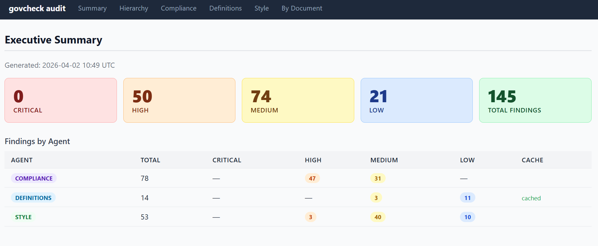

# 🏛️ Auto-audit

**Automated compliance verification for governance document hierarchies.**

Auto.audit automates auditing of policies, procedures, and guidelines. It automatically checks compliance across document hierarchies, detects inconsistent definitions, and analyzes writing quality.

**This is a proof of concept.**
To see a test report vist [auto-audit-poc] (https://audit-pipeline.tiiny.site/#summary))



To become a more useable product the project would need time dedicated to:
- switch to Microsoft ecosystem for enterprise grade security and compliance (just an Azure / Copilot API key)
- tune the agents for the different models
- testing variety of document types for parsing, and even diagrams for process extraction
- optimization for a variety of laws, standards, policies, in a variety of fields
--conversation about how to achieve this (e.g., generalized agents, vs specialised agents in given frameworks; LLM semantic extraction vs. efficiency, etc,; confidence levels for possible gaps requesting human judgement)
--v1.2 baked in some generalizations (to pick up language from ISO, GDPR, NIST, HIPAA, general data governance language) and an LLM gap checker for technical-seeming terms which are not clearly defined ('--detect-implied')
--we could even give the agents some plain text context about how to interpret the laws/standards.
- creating more/further specialised agents for different tasks
- user interface for uploading documents and configuring hierarchy (currently all command line and yaml) 
- features for auto-updating the documents based on the report


## The Problem

Governance frameworks are complex. Standards like ISO 27001 define high-level requirements, but organizations must translate those into policies, then into procedures. As hierarchies grow, it becomes difficult to verify:

- ✅ Does every parent requirement actually get addressed by child documents?
- ✅ Are technical terms defined consistently across the organization?
- ✅ Is the writing clear, consistent, and professional?
- ✅ What gaps exist in coverage?

Manual audits are slow, error-prone, and costly. **GovCheck automates this.**

## Key Features

🚀 **Compliance Checking** — Verify that mutable documents conform to immutable references (regulations, standards). Detect sibling inconsistencies between related procedures. Get detailed reports showing conformance status and internal consistency.

📖 **Definition Consistency** — Extract and compare term definitions across your document hierarchy. Identify conflicting and inconsistent use of terms automatically.

✏️ **Style Analysis** — Detect writing inconsistencies, banned words, readability issues, and terminology drift across your governance documents.

📊 **Beautiful Reports** — Generate consolidated HTML or Markdown audit reports with clear findings, severity levels, and actionable insights. Findings tables are filterable by severity, document, and keyword directly in the browser.

⚡ **Intelligent Caching** — Claude API results are cached by document hash, so unchanged documents are served instantly on subsequent runs.

🗂️ **Multi-Format Support** — Ingest documents from PDF, DOCX, Markdown, and plain text files organized in a flexible hierarchy.

## Installation

### Prerequisites
- Python 3.11 or later
- An Anthropic API key ([get one here](https://console.anthropic.com/))

### Quick Start

```bash
# Clone the repository
git clone <repository-url>
cd govcheck

# Install in editable mode
pip install -e .

# Set your API key (create a .env file or export via shell)
echo "ANTHROPIC_API_KEY=sk-..." > .env
```

## Quick Usage

### 1. Define Your Hierarchy

Create a `hierarchy.yaml` that describes your document structure:

```yaml
hierarchy:
  - id: iso27001
    title: "ISO 27001:2022"
    file: "iso27001.pdf"
    level: "standard"
    immutable: true              # Can't change; all docs must conform
    parsing_hints: "numbered"
    children:
      - id: infosec-policy
        title: "Company InfoSec Policy"
        file: "infosec-policy.docx"
        level: "policy"
        immutable: false          # Can change to stay consistent
        parsing_hints: "markdown"
        children:
          - id: access-control-proc
            title: "Access Control Procedure"
            file: "access-control.docx"
            level: "procedure"
            immutable: false
```

**Levels:** `standard`, `policy`, `procedure`, `guideline`  
**Immutable:** `true` (reference docs that others conform to) or `false` (docs you can change)  
**Parsing Hints:** `numbered`, `markdown`, `caps`, `auto` (default)

### 2. Ingest Documents

```bash
govcheck ingest --docs ./documents --hierarchy hierarchy.yaml
```

This extracts text from your documents, splits them into sections, and stores them in SQLite.

### 3. Explore Your Hierarchy

```bash
# View the document tree
govcheck tree --no-color

# List sections in a document
govcheck sections infosec-policy

# Display content
govcheck show infosec-policy --section "4.1"
```

### 4. Run Compliance Checks

```bash
# Check if a child addresses a parent's requirements
govcheck check compliance --parent iso27001 --child infosec-policy

# Check all parent-child relationships
govcheck check compliance --all --output ./reports
```

**Result:** For each requirement found in the parent, GovCheck classifies the child as:
- ✅ **covered** — requirement is explicitly addressed
- 🔍 **human review** — requirement is partially addressed; human judgement needed to determine if it is a genuine gap
- ❌ **not_covered** — requirement is missing
- 🚫 **contradicted** — child contradicts the requirement

### 5. Check Definition Consistency

```bash
govcheck check definitions --output ./reports
```

By default, definitions are extracted from centralised glossary sections. Use `--extraction-mode` to change or combine strategies:

```bash
# Default: look in glossary sections only
govcheck check definitions -m glossary

# Extended: loose patterns across every section (finds distributed definitions)
govcheck check definitions -m inline

# AI-powered: Claude identifies contextually-defined terms without explicit markers
govcheck check definitions -m semantic

# Combined: pattern-based first, then AI gap-fill
govcheck check definitions -m glossary -m semantic
govcheck check definitions -m inline -m semantic
```

**Extraction modes:**

| Mode | What it finds | When to use |
|------|--------------|-------------|
| `glossary` | Terms in dedicated glossary/definitions sections | Most documents; fast and precise |
| `inline` | Distributed definitions using loose patterns (`**Term**: ...`, parentheticals, "hereafter referred to as") | Documents that define terms inline throughout the text |
| `semantic` | Contextually-defined terms identified by Claude, even without explicit linguistic markers | Complex regulatory or standards documents; requires API call per batch |

Modes can be combined with multiple `-m` flags. Results are merged and de-duplicated.

Identifies:
- Inconsistent definitions of the same term across the hierarchy
- Missing definitions for extracted terms
- Orphaned definitions (defined but never used)

### 6. Analyze Writing Style

```bash
# Check a single document
govcheck check style --doc infosec-policy

# Check all documents
govcheck check style --all --config .govcheck-style.yaml
```

**Checks:**
- Modal consistency (shall vs. must vs. may)
- Banned words and phrases
- Preferred terminology
- Readability metrics
- Terminology consistency

### 7. Run a Full Audit

```bash
# One command to rule them all
govcheck audit --all --format html --output ./reports
```

Combines compliance, definitions, and style checks into a single consolidated report with severity filtering.

## Architecture

GovCheck follows a clean data pipeline:

```
hierarchy.yaml
    ↓
[hierarchy.py] — Parse & validate
    ↓
[extractor.py] — Extract text (PDF/DOCX/MD/TXT)
    ↓
[section_parser.py] — Split into sections
    ↓
[db.py] — Store in SQLite
    ↓
[*_extractor.py] — Pull requirements, definitions
    ↓
[*_checker.py] — Claude API analysis
    ↓
[report_generator.py] — HTML/Markdown reports
```

### Key Modules

- **`cli.py`** — Command-line interface (Click)
- **`hierarchy.py`** — YAML parser and tree walker
- **`extractor.py`** — Multi-format document extraction
- **`section_parser.py`** — Intelligent section splitting (numbered, markdown, caps)
- **`db.py`** — SQLite persistence layer
- **`requirements_extractor.py`** — Obligation sentence extraction
- **`compliance_checker.py`** — Parent→child requirement analysis
- **`definitions_extractor.py`** — Term extraction and glossary parsing
- **`definitions_checker.py`** — Definition consistency analysis
- **`style_checker.py`** — Writing quality and consistency checks
- **`audit_cache.py`** — SHA-256-based result caching
- **`report_generator.py`** — HTML and Markdown report generation

### Database Schema

- **documents** — `id`, `title`, `filename`, `doc_type`, `level`, `content`, `ingested_at`
- **hierarchy** — `id`, `parent_id`, `position` (tree structure)
- **sections** — `section_id`, `doc_id`, `heading`, `level`, `content`, `position`
- **audit_cache** — `cache_key`, `check_type`, `result_json`, `created_at` (API result caching)

## Configuration

### Style Checks Configuration

Create a `.govcheck-style.yaml` file:

```yaml
# Modal preferences
modal_consistency:
  preferred_modals:
    - "shall"
    - "must"
    - "may"
    - "should"

# Words/phrases to avoid
banned_patterns:
  - "TBD"
  - "etc\\."
  - "TODO"

# Preferred terminology
preferred_terms:
  "information security": "infosec"
  "authentication": "auth"
```

### Style Check Options

```bash
govcheck check style --all \
  --config custom-style.yaml \
  --output ./reports \
  --db ~/custom.db
```

## Advanced Usage

### Custom Database Location

```bash
# Default: ~/.govcheck/govcheck.db
govcheck ingest --docs ./docs --hierarchy hierarchy.yaml --db ./custom.db
govcheck check compliance --all --db ./custom.db
```

### Filtered Audit Reports

```bash
# Only critical and high severity findings
govcheck audit --all --severity critical high --output ./reports
```

### Clearing the Cache

```bash
# Re-run all checks (forces fresh Claude API calls)
govcheck audit --all --clear-cache
```

## Example Output

### Compliance Check Report

```
Parent: ISO 27001:2022
Child: Company InfoSec Policy

Requirement: "Organizations shall conduct a regular information security risk assessment"
Status: ✅ COVERED
Evidence: Section 4.2 addresses risk assessment procedures
Confidence: High

Requirement: "Access controls shall be reviewed every 90 days"
Status: 🔍 HUMAN REVIEW
Evidence: Section 3.1 mentions review procedures but does not specify frequency
Note: Partially addressed — human judgement needed to confirm whether this is a genuine gap
```

### Definition Consistency Report

```
Term: "Information Asset"

Definition in ISO 27001:
  "Any information or information processing facility that is important to the organization"

Definition in InfoSec Policy:
  "Critical business information requiring protection"

Status: ⚠️ INCONSISTENT
Issue: Definitions differ in scope and emphasis
Recommendation: Align definitions or clarify scope in child policy
```

### Style Check Report

```
Document: InfoSec Policy
Total Issues: 8

Issue 1: Modal Inconsistency (Line 42)
  "Access controls should be reviewed" [uses "should" instead of preferred "shall"]
  
Issue 2: Banned Pattern (Line 156)
  "Access control procedures are TBD" [contains "TBD"]

Issue 3: Readability (Low confidence)
  Paragraph at line 203 is 450 words; suggest breaking into smaller sections
```

## API Model

GovCheck uses **Claude Sonnet 4** by default for all AI analysis. To use a different model, update the `MODEL` constant in the checker files:

```python
# govcheck/compliance_checker.py
MODEL = "claude-sonnet-4-20250514"
```

## Performance Considerations

- **First run:** API calls are made for each check (compliance, definitions, style)
- **Subsequent runs:** Unchanged documents are served from the `audit_cache` table—**instant**
- **Cache key:** SHA-256 hash of document content
- **Cache invalidation:** Automatic when document content changes; manual via `--clear-cache`

## Environment Setup

```bash
# Using Poetry (if available)
poetry install

# Using pip with venv (recommended)
python -m venv .venv
source .venv/bin/activate  # On Windows: .venv\Scripts\Activate.ps1
pip install -e .

# Set API key
export ANTHROPIC_API_KEY=sk-...  # Or add to .env file
```

## Interpreting Results

GovCheck is designed to surface potential issues for human review, not to make definitive compliance judgements. AI analysis has inherent limitations, and findings should be treated as a starting point for investigation rather than a final verdict.

### Compliance Findings

The report uses four compliance statuses, mapped to three severity levels and one review category:

| Status | Report category | Meaning |
|--------|----------------|---------|
| `contradicted` | **Critical** | Child document actively contradicts the requirement |
| `not_covered` | **High** | No corresponding content found |
| `partially_covered` | **Human Review** | Partially addressed; AI uncertain whether this is a genuine gap |
| `covered` | *(not reported)* | Requirement is adequately addressed |

**Human Review findings** are where the AI found some relevant content but could not confidently determine whether the requirement is fully met. These warrant direct inspection rather than automatic remediation — in many cases the coverage is sufficient and the finding can be closed without action.

**`not_covered` findings also require human review.** The compliance checker uses keyword matching to pre-select the most relevant sections of a child document before passing them to the AI. When parent and child documents use different terminology for the same concept — common across hierarchy levels (e.g. a standard using "data assets" where a procedure says "datasets") — a relevant section may rank below the cutoff and be excluded from analysis. The AI never sees it, and the finding is reported as `not_covered`.

When reviewing `not_covered` findings:
- Check the **References** column in the report to see which sections were actually analysed. If those sections appear topically unrelated to the requirement, the finding is likely a terminology mismatch rather than a genuine gap.
- Requirements written in abstract or regulatory language (ISO, GDPR, NIST) checked against operational procedures are the most likely source of false negatives.

Run definitions and compliance checks together — an inconsistent definition of a term that appears in a parent requirement is a strong signal that coverage gaps may exist even where the compliance checker reports `covered`.

### Definition Consistency Findings

Definition inconsistencies are high-value signals. If the same term is defined differently at different levels of the hierarchy, child documents may be operating on a different understanding of the requirement than the parent intended. These findings warrant direct review by document owners rather than a simple edit.

### Running a Thorough Audit

To surface the broadest set of potential issues for human triage, run with the lowest severity threshold:

```bash
govcheck audit --all --format html --severity low --output ./reports
```

Filtering to `critical` or `high` at the command line may suppress findings that a reviewer would consider significant in context.

The generated HTML report also includes **in-browser filter controls** on each findings table. You can filter by severity (including the Human Review category), document, or keyword without re-running the audit.

### Cache and Document Revisions

The cache stores AI results keyed to document content. If a document is revised and re-ingested, its cache entry is automatically invalidated and checks re-run. However, if you are unsure whether the database reflects the latest document versions, use `--clear-cache` to force a full fresh run:

```bash
govcheck audit --all --clear-cache
```

This is particularly important after terminology changes, as cached results from a previous version will not reflect how revised wording affects coverage.

---

## Troubleshooting

**No sections detected in documents?**
- Try explicit `parsing_hints`: `numbered`, `markdown`, or `caps`
- Check document format (PDFs might need better extraction)

**API rate limits hit?**
- GovCheck batches requests, but large hierarchies may trigger rate limits
- Wait a few minutes or use `--clear-cache` to resume

**Database errors?**
- Delete `~/.govcheck/govcheck.db` (or your custom `--db` path) to reset
- Re-run `ingest` to rebuild the database

## Contributing

This project is designed to be extended. Common customizations:

- **New document formats** — Add extraction logic to `extractor.py`
- **Custom checks** — Create new `*_checker.py` modules and integrate via `cli.py`
- **Report formats** — Extend `report_generator.py`
- **Section parsing** — Enhance `section_parser.py` with domain-specific patterns

## License & Support

For issues, questions, or contributing ideas, please reach out or open an issue in the repository.

---

